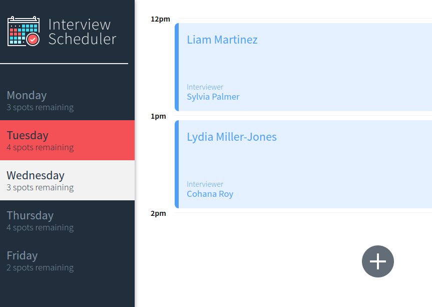

---
# Metadata
title: "Interview Scheduler"
type: "Bootcamp - React"

# Thumbnails
thumbnail: "./thumbnail.png"

# Options
path: "/interviewscheduler/"
order: 2
---

<article role="article">

A modern, single page client application that allows interviews to be booked Monday to Friday. Built with React and <a href="https://pensive-sinoussi-912e59.netlify.app/" target="_blank">deployed to Netlify</a>  Data is persisted through the use of a PostgreSQL database communicating with an Axios client. Full testing suite has been built using Storybook, Jest and Cypress.

</article>

<article role="article">

This project was built as part of Lighthouse Labs Web Development Bootcamp (Dec 2020)

</article>
