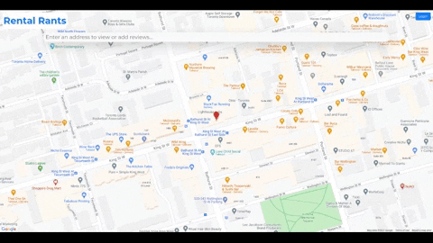
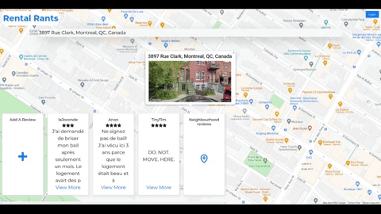

---
# Metadata
title: "Rental Rants"
type: "Bootcamp - React"

# Thumbnails
thumbnail: "./thumbnail.png"

# Options
path: "/rentalrants/"
order: 0
---

<article role="article">

<a href="https://www.rental-rants.com" target="_blank">**Rental Rants**</a> is a full-stack single-page web application that allows users to create and view tenancy reviews linked to property addresses. It was born out of a desire to level the playing field between tenants and landlords. Built as a group final project with the wonderful [Emily Tupper](https://github.com/emtupp) and splendid [Jared Flomen](https://github.com/JaredFlomen) in Lighthouse Labs Web Development Bootcamp (Jan 2021).
       
Front-end: React JS, react-google-maps, Bootstrap, Netlify                                                      
Back-end: Node, Express, PostgreSQL, Heroku      

</article>

<article role="article">

Rate your awful (or amazing) rental experience.

</article>

<article role="article">

Check to see reviews of a prospective rental...

</article>

<article role="article">

...and the surrounding neighbourhood.

</article>

<article role="article">

The <a href="https://github.com/danunder/rental-rants-client" target="_blank">Rental Rants client</a> is hosted on Netlify and uses the Google Maps and Places Autocomplete APIs to search for an address and return latitude and longitude coordinates. Review data is linked to these coordinates and a <a href="https://github.com/danunder/rental-rants-backend" target="_blank" >Node JS / Express server</a>, deployed to Heroku, with PSQL database persists the reviews.  

</article>
