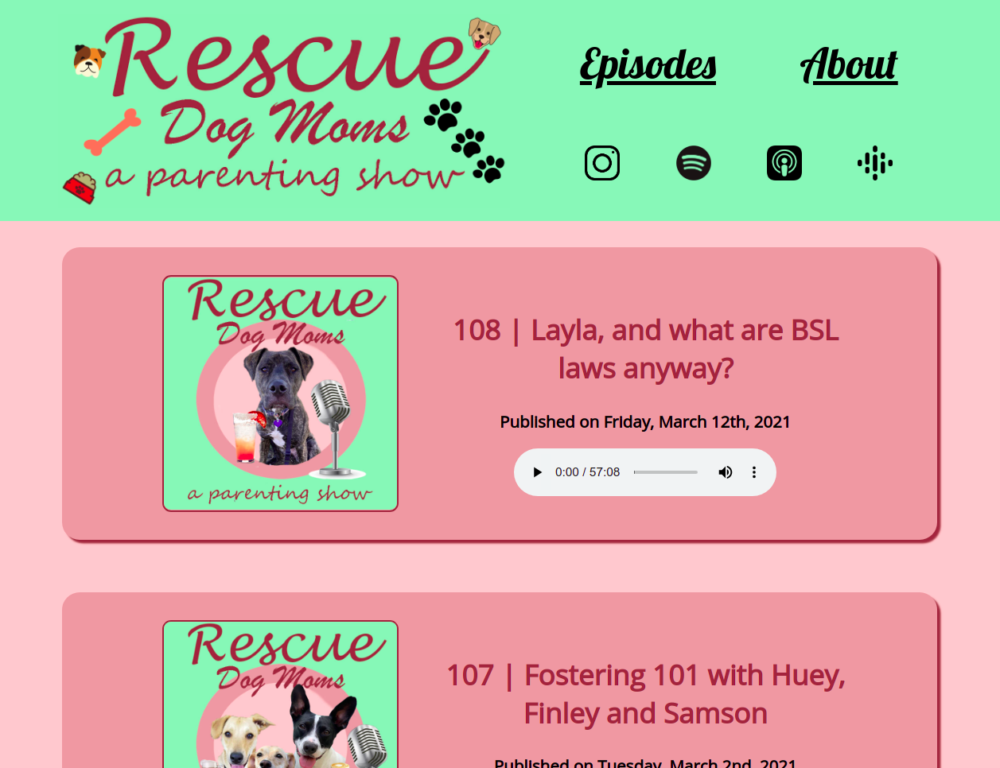

---
# Metadata
title: "Rescue Dog Moms"
type: "Client - React"

# Thumbnails
thumbnail: "./bossheroimage.jpg"

# Options
path: "/rescuedogmoms/"
order: 1
---

<article role="article">

My partner Yamini and I have been fostering dogs since the start of the pandemic. We had what's known as a foster fail with our first dog, Boss, who still remains a valued (and spoiled) member of our household. Yamini has her fingers deep in a number of dog-rescue pies and records entertaining and enlightening conversational content with her 'dog-friends'. <a href="https://www.rescuedogmoms.ca/" target="_blank">Check out her episodes here</a>.
</article>

   

<article role="article">

Rescue Dog Moms was built using create-react-app, vanilla CSS (never again) and accesses the Buzzsprout podcast hosting API to populate content. Built in December 2020 (during bootcamp!)

</article>