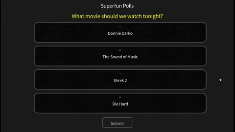
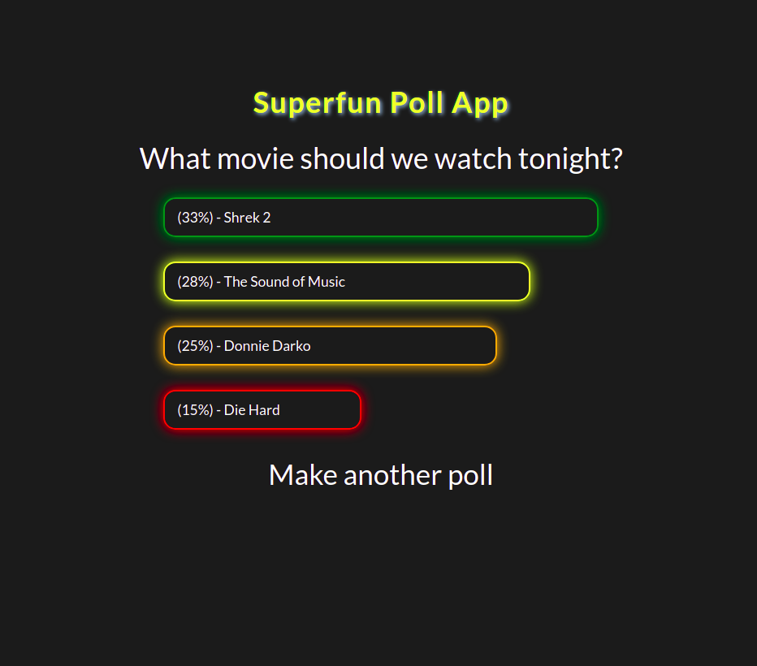

---
# Metadata
title: "Superfun Poll App"
type: "Bootcamp - Group"

# Thumbnails
thumbnail: "./thumbnail.png"

# Options
path: "/superfunpollapp/"
order: 3
---

<article role="article">

This is the <a href="https://sleepy-inlet-66286.herokuapp.com/" target="_blank">very first thing I ever deployed!</a> Allows creation of and voting on polls, with results generated using the Borda count method. 
</article>

<article role="article">

Front-end: HTML, SASS, EJS, JQuery  
Back-end: Node, Express, PostgreSQL

</article>

<article role="article">

Built as a midterm project with the excellent <a href="https://github.com/soccermind" target="_blank">Alberto Sotres</a> and marvellous <a href="https://github.com/gybubest" target="_blank">Yu Gao</a> in Lighthouse Labs Web Development Bootcamp (Nov 2020). Forgive us our awful design skills.

</article>
